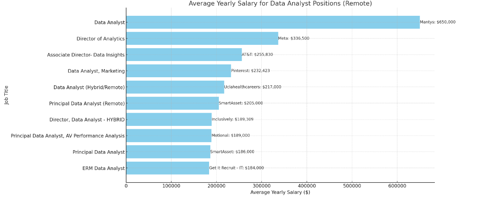
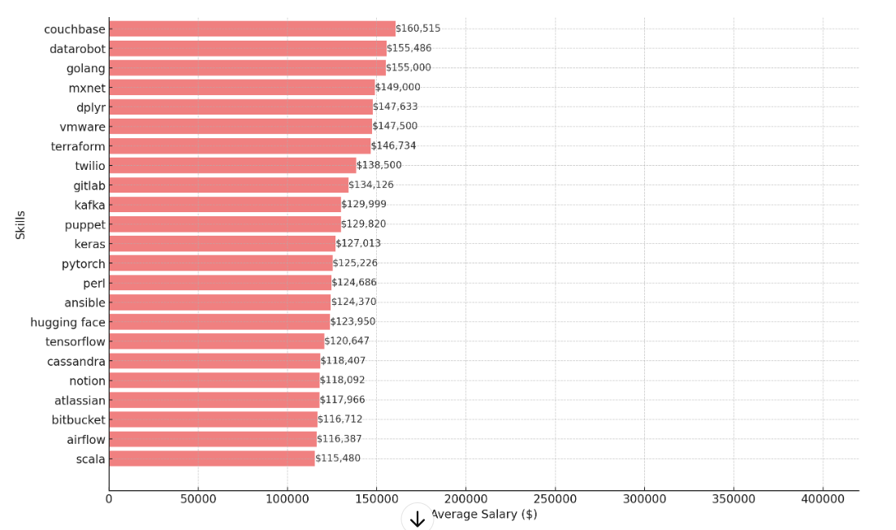
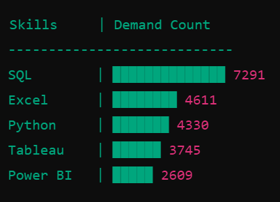
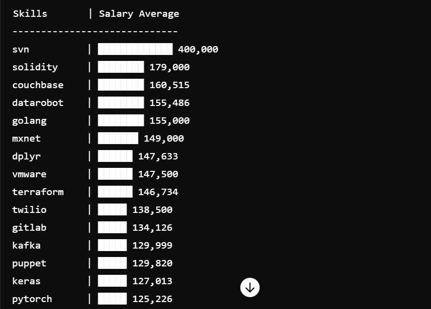
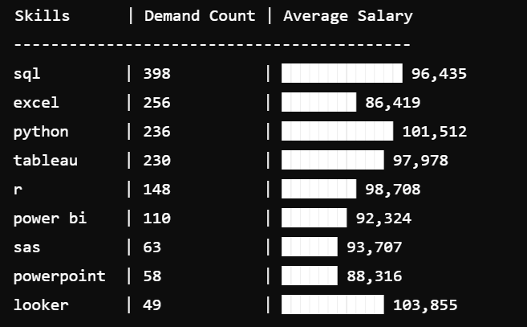

# Introduction
Dive into the data job market! Focusing on data analysts role, this project explores top paying jobs, in-demand skills, and where high demands meet high salary in data analytics.

SQL queries? check them out here: [project_sql folder](/projects.sql/)

# Background
Driven by a quest to navigate the data analyst job market more effectively, this project was born from a desire to pinpoint top-paid and in-demand skills, streamlining others work to find optimal jobs

Data hails from my [SQL Course](https://lukebarousse.com/sql). It's packedwith insights on job titles, salaries, locations, and essential skills.

### The questions I wanted to answer through my SQL queries were: 

1. What are the top_paying data analyst jobs?
2. What skills are required for these top-paying jobs?
3. What skills are most in-demand for data analysts?
4.Which skills are associated with higher salaries?
5. What are the most optimal skills to learn

# Tools I Used
For my deep dive into the data analyst job market, I harnessed the power of several key tools:

- **SQL:** The backbone of my analysis, allowing me to query the database and uncover critical insights.
- **PostgreSQL:** The chosen database management system, ideal for handling the job posting data.
- **Visual Studio Code:** My go-to for database management and executing SQL queries.
- Git & Github: Essential for version control and sharing my SQL scripts and analysis, ensuring collaboration and project tracking.


# The Analysis
Each query for this project aimed at investigating specific aspects of the data analyst job market. 
Here is how I approached each question:

### 1. Top Paying Data Analyst Jobs
To identify the highest-paying roles I filtered data analyst positions by average yearly salary and location, focusing on remote jobs. This query highlights the high paying opportunities in the field 

``` sql
SELECT
    job_id,
    job_title,
    job_location,
    job_schedule_type, 
    salary_year_avg,
    job_posted_date,
    name as company_name
FROM
    job_postings_fact
LEFT JOIN company_dim ON job_postings_fact.company_id = company_dim.company_id
where 
     job_title_short = 'Data Analyst' and 
    job_location  = 'Anywhere'  and 
    salary_year_avg is not NULL
order by 
    salary_year_avg DESC
limit 10;

```



### 2. Skills For Top Paying Jobs
To understand what skills are required for the top-paying jobs, I joined the job postings with the skills data, providing insights into what employers value for high-compensation roles. 

```sql 


with top_paying_job AS (
SELECT
    job_id,
    job_title,
    salary_year_avg,
    name as company_name
FROM
    job_postings_fact
LEFT JOIN company_dim ON job_postings_fact.company_id = company_dim.company_id
where 
     job_title_short = 'Data Analyst' and 
    job_location  = 'Anywhere'  and 
    salary_year_avg is not NULL
order by 
    salary_year_avg DESC
limit 10
)

select
    top_paying_job.*,
    skills
from top_paying_job
inner JOIN skills_job_dim on top_paying_job.job_id = skills_job_dim.job_id
INNER JOIN skills_dim on skills_job_dim.skill_id = skills_dim.skill_id
ORDER BY
    salary_year_avg DESC
```


### 3. In-Demand Skills for Data Analysts
This query helped identify the skills most frequently requested in job postings, directing focus to areas with high demand.

```sql
select 
    skills,
    count(skills_job_dim.job_id) as demand_count
    from job_postings_fact
inner JOIN skills_job_dim on job_postings_fact.job_id = skills_job_dim.job_id
INNER JOIN skills_dim on skills_job_dim.skill_id = skills_dim.skill_id
where 
    job_title_short = 'Data Analyst' and job_work_from_home = TRUE
GROUP BY
    skills
order BY
    demand_count DESC
limit 5
```

### 4. Skills Based On Salary
Exploring the average salaries assosiated with different skills aveareged which skills are the highest paying

```sql

select 
    skills,
    round(avg(salary_year_avg),0) as salary_average
    from job_postings_fact
inner JOIN skills_job_dim on job_postings_fact.job_id = skills_job_dim.job_id
INNER JOIN skills_dim on skills_job_dim.skill_id = skills_dim.skill_id
where 
    job_title_short = 'Data Analyst' and salary_year_avg is not NULL
GROUP BY
    skills
order BY
    salary_average DESC
limit 25

```



### 5. Optimal Skills to Learn

Combining insights from demand and salry data, this query aimed to pinpoint skills that are both in high demand and have high salaries, offering a strategic focus for skill development.

```sql


with skills_demand as (
select 
    skills_dim.skill_id,
    skills_dim.skills,
    count(skills_job_dim.job_id) as demand_count
    from job_postings_fact
inner JOIN skills_job_dim on job_postings_fact.job_id = skills_job_dim.job_id
INNER JOIN skills_dim on skills_job_dim.skill_id = skills_dim.skill_id
where 
    job_title_short = 'Data Analyst' and job_work_from_home = TRUE and salary_year_avg is not NULL
GROUP BY
    skills_dim.skill_id
)
,average_salary as (
select 
    skills_job_dim.skill_id,
    avg(salary_year_avg) as salary_average
    from job_postings_fact
inner JOIN skills_job_dim on job_postings_fact.job_id = skills_job_dim.job_id
INNER JOIN skills_dim on skills_job_dim.skill_id = skills_dim.skill_id
where 
    job_title_short = 'Data Analyst' and salary_year_avg is not NULL
GROUP BY
    skills_job_dim.skill_id
)
select
    skills_demand.skill_id,
    skills_demand.skills,
    demand_count,
    average_salary
from 
    skills_demand
inner join average_salary on skills_demand.skill_id = average_salary.skill_id
ORDER BY
    demand_count DESC,
    average_salary
LIMIT 10

```


# Conclusions

### Insights

1. **Top-Paying Data Analyst Jobs**: The highest-paying jobs for data analysts that allow remote work offer a wide range of salaries, the highest at $650,000!
235
2. **Skills for Top-Paying Jobs**: High-paying data analyst jobs require advanced proficiency in
**SQL**, suggesting it's a critical skill for earnin a top salary.
236
3. **Most In-Demand Skills: SQL** is also the most demanded skill in the data analyst job market, thus making it essential for job seekers.
237
4. **Skills with Higher Salaries**; Specialized skills, such as SVN and Solidity, are associated with the highest average salaries, indicating a premium on niche expertise. I 238
5. **Optimal Skills for Job Market Value**; SQL leads in demand and offers for a high average salary, positioning it as one of the most optimal skills for data analysts to learn to maximize their market value.

## Closing Thoughts
This project enhanced my SQL skills and provided valuable insights into the data analyst job market. The findings from the analysis serve as a guide to prioritizing skill development and job search efforts. Aspiring data analysts can better position themselves in a competitive job market by focusing on high-demand, high-salary skills. This exploration highlights the importance of continuous learning and adaptation to emerging trends in the field of data analytics


